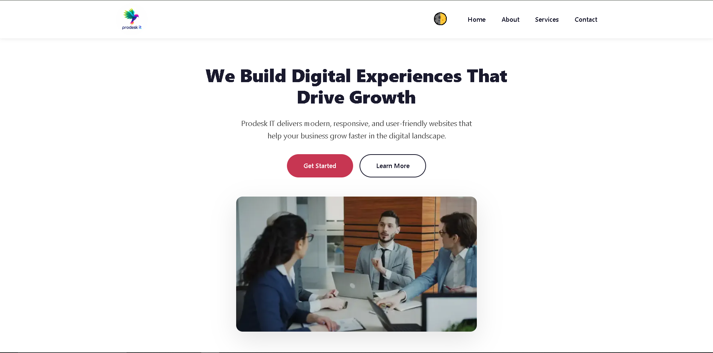

# The Corporate Brand — Prodesk IT

A professional and responsive corporate landing page developed as part of the Prodesk IT Sprint 1 assignment.

## Project Description

The Corporate Brand is a modern corporate landing page created to demonstrate frontend development fundamentals using HTML5, CSS3 and Vanilla JavaScript.

The project focuses on clean HTML structure, CSS Flexbox, CSS Grid, responsive design and basic JavaScript interactions.

## Technologies Used

- HTML5
- CSS3
- Vanilla JavaScript

No Bootstrap, Tailwind CSS or other UI framework is used for the Sprint 1 base implementation.

## Features

### Phase 1 — Base MVP

- Responsive navigation bar
- Company logo
- Home section
- Hero section
- Call-to-action buttons
- About section
- Three service cards
- Contact information
- Footer
- CSS Flexbox
- CSS Grid
- Responsive desktop and mobile layout

### Phase 2 — UI/UX Enhancements

- Dark/Light mode toggle
- Mobile hamburger menu
- Button hover effects
- Service card hover effects
- Sticky navigation

### Phase 3 — Enhancements

- Glassmorphism navigation effect
- Smooth scrolling
- Performance and accessibility improvements

## Responsive Design

The website is designed to work across different screen sizes including:

- Desktop
- Laptop
- Tablet
- Mobile

The service cards use CSS Grid on larger screens and adapt to a suitable mobile layout on smaller screens.

## Project Structure

prodesk-it-corporate-brand/
│
├── index.html
├── style.css
├── script.js
├── logo.webp
├── hero-banner.webp
├── README.md
└── Prompts.md

## Local Setup

1. Download or clone the repository.
2. Open the project folder in VS Code.
3. Open `index.html` in a browser.

*You can also use VS Code Live Server for local development.*

## Live Website

**Live URL:**  
[https://prodesk-sprint-1-coral.vercel.app/]

## GitHub Repository

**Repository URL:**  
[(https://github.com/shashank113333/prodesk-sprint-1)]

## Project Screenshot

QA
The project should be tested for:

Desktop responsiveness
Tablet responsiveness
Mobile responsiveness
Navigation
Hamburger menu
Dark/Light mode
Hero buttons
Service cards
Hover effects
Sticky navigation
Glassmorphism
Image loading
Console errors
Horizontal overflow
Lighthouse Scores

Performance: 99
Accessibility: 100
Best Practices: 100
SEO: 100

